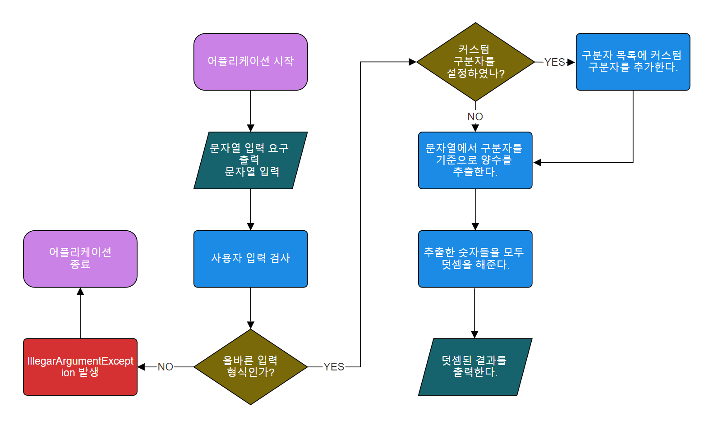

# 문자열 덧셈 계산기

## 요구사항 분석
- [ ]  입력한 문자열에서 숫자를 추출하여 더하는 계산기를 구현한다.
    - [ ]  구분자와 양수를 가지는 문자열을 입력받는다.
        - [ ]  기본 구분자를 기준으로 숫자를 추출한다.
        - [ ]  기본 구분자 이외에 문자열 앞 부분에 “//”와 “\n”사이에 커스텀 구분자를 지정할 수 있다.
        - [ ]  사용자가 잘못된 값을 입력할 경우 IllegalArgumentException을 발생시키고 종료한다.
    - [ ]  추출한 양수들을 덧셈한다.
    - [ ]  덧셈된 결과를 출력한다.

## 플로우차트

